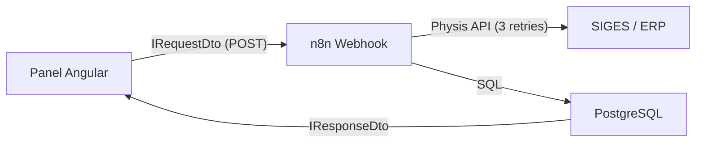

# 📚 Documentación Técnica - Panel Administrativo Physis

> **Propósito**: Manual detallado para el desarrollo, mantenimiento y escalabilidad del Panel Administrativo "Bolsa de Café".

---

## 🏗️ Arquitectura de Comunicación (POST-Centric)

La aplicación sigue el patrón **Cliente Ligero / Orquestador Inteligente**.



---

## 🧩 Modelos de Datos (Strongly Typed)

La aplicación implementa tipado estricto (SIN `any`). Las interfaces clave se encuentran en `src/app/core/interfaces/dashboard.interfaces.ts`.

### 1. Interfaz de Dominio (`IContacto`)
Representa el contacto operativo en Postgres.
```typescript
{
    id: string | number;        // PK de Postgres
    IdCtaAuxi: string;          // Id de Cuenta Physis
    IdContacto: string;         // Número incremental por cliente
    Nombre: string;             // Nombre Autorizado
    Telefono: string;           // WhatsApp (+549...)
    ListaPrecio: number;        // Lista asignada
    BotActivo: string | number; // Estado '1' o '0'
}
```

### 2. Payloads de Integración (DTOs)
- **`ICrearContactoDto`**: Para altas en `/crear-contacto-bot`.
- **`IEditarContactoDto`**: Extiende la creación añadiendo el `id` para `/actualizar-bot`.
- **`IActualizarBotDto`**: Payload mínimo para activar/desactivar.

---

## 🔄 Flujos de Webhooks y Lógica en n8n

### `/crear-contacto-bot` (POST)
**Lógica**: 
1. Recibe el `idCtaAuxi`.
2. Ejecuta `SELECT MAX(IdContacto) + 1 FROM contactos WHERE IdCtaAuxi = ...` para calcular el siguiente ID.
3. Inserta (`UPSERT`) el nuevo registro incluyendo `Nombre`, `Telefono`, `Direccion` y `Email`.

### `/actualizar-bot` (POST)
**Lógica**:
- Si recibe todos los campos (Nombre, Telefono, Lista): Realiza un `UPDATE` completo.
- Si solo recibe `id` y `botActivo`: Solo actualiza el estado (`enable/disable`).

### `/eliminar-contacto` (POST)
**Lógica**: 
- Recibe el `id`.
- Ejecuta `DELETE FROM contactos WHERE id = ...`.

---

## 🚦 Gestión de Estado (Angular Signals)

El dashboard utiliza **Angular Signals** para una reactividad zoneless y eficiente.

- **`activeTab`**: Controla la visualización modular (Métricas, Terceros, Bots).
- **`isEditing`**: Señal booleana que transforma el modal de "Alta" en "Edición" automáticamente.
- **`toastMsg` / `toastType`**: Gestiona las notificaciones transversales de éxito o error.

---

## 🎨 Design System e Identidad Visual

- **Layout**: Glassmorphism con bordes difuminados y fondos dinámicos (`#0f172a`).
- **Pills de Estado**:
    - `HABILITADO`: Verde neón con opacidad.
    - `BLOQUEADO`: Rojo coral suave.
- **Iconos**: Uso de `Lucide Icons` para consistencia y peso mínimo de bundle.

---

## ⚙️ Políticas de Resiliencia y Offline

- **Tolerancia a fallos**: Todas las llamadas críticas se envuelven en `catchError` que devuelve datos seguros (arrays vacíos) para evitar que el UI se bloquee si un webhook falla.
- **Sincronización**: Al realizar cualquier cambio (Alta, Baja o Modificación), se dispara un `fetchData()` automático para mantener la vista sincronizada con la base de datos real.

---

## 📋 Guía de Mantenimiento

1. **Añadir campos**: Si el ERP Physis añade campos nuevos (ej. "Localidad"), agrégalos primero a la interfaz `ITercero` y `ICrearContactoDto`.
2. **Validaciones**: Las validaciones complejas de negocio (ej. si el cliente tiene deuda) se hacen en n8n antes de responder al Webhook. El frontend solo valida formatos (ej. números de teléfono).

---
© 2026 Physis SRL | Documentación Técnica Interna
